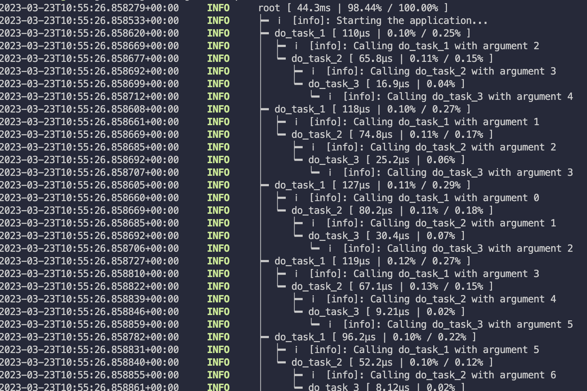
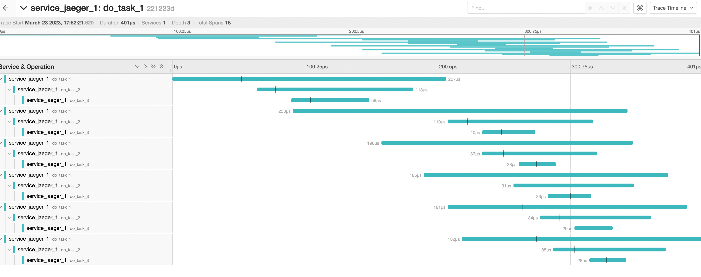

# TRACING-RS-EXAMPLES

## Setup
```
docker-compose up -d
```

## Run
```
RUST_LOG=info cargo run
```

Results:

Stdout:



Jaeger:



## Notes
Because Jaeger accepts OTLP over gRPC, we don't really need to use the `opentelemetry-jaeger` to export traces to Jaeger. It is recommended to use `opentelemetry-otlp` crate instead. The `opentelemetry-jaeger` crate used in this example is just for demonstration purposes.